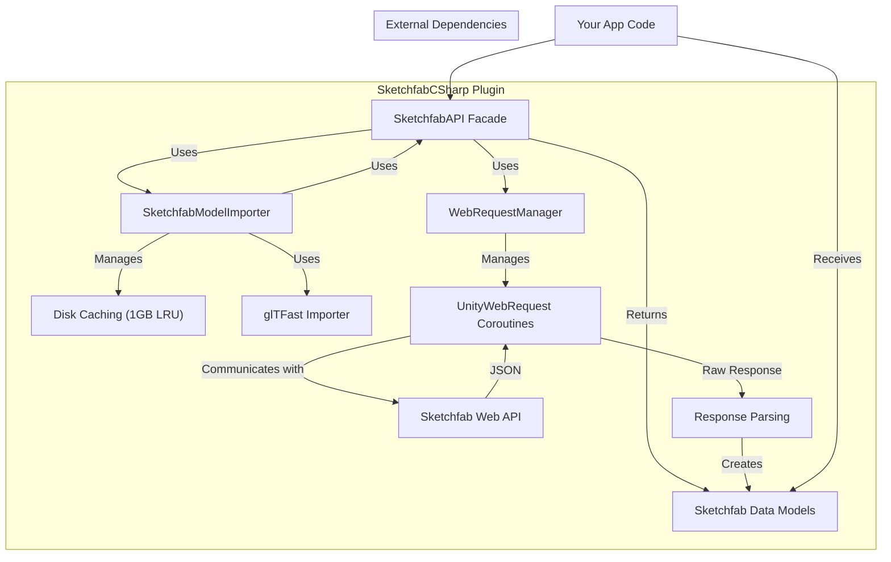
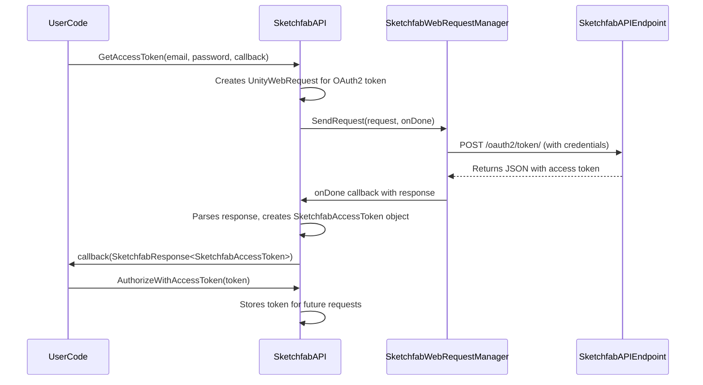
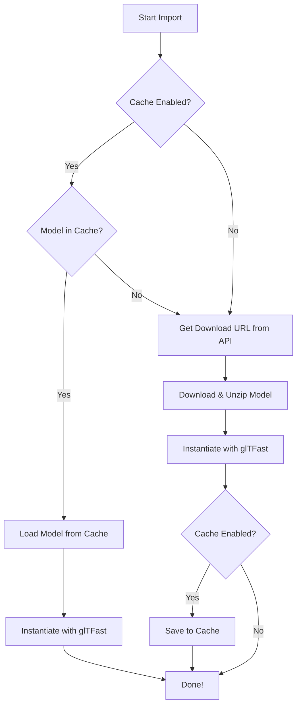

# SketchfabCSharp Plugin Documentation

This document provides a comprehensive overview of the `SketchfabCSharp` Unity plugin, its architecture, features, and how to use it effectively.

## 1. Introduction

`SketchfabCSharp` is a C# wrapper for the Sketchfab API v3, designed for easy integration into Unity projects. It allows you to authenticate, search, and import 3D models from Sketchfab directly into your Unity scenes at runtime. The plugin handles API requests, model downloading, and caching, providing a streamlined workflow for developers.

## 2. Features

*   **Authentication**: Supports OAuth2 password-based authentication to get an access token for making API calls.
*   **Model Search**: Search for models on Sketchfab with extensive filtering options, including tags, categories, poly count, and more.
*   **Model Information**: Retrieve detailed metadata for any model, including its name, description, license, and technical details.
*   **User Information**: Get information about Sketchfab users.
*   **Category Listing**: Fetch the list of available categories on Sketchfab.
*   **Model Downloading & Instantiation**: Download `glTF` models and instantiate them in your scene using the `glTFast` library.
*   **Disk Caching**: Automatic caching of downloaded models and metadata to reduce API calls and improve loading times. The cache has a default size of 1GB and uses a "Least Recently Used" eviction policy.
*   **Asynchronous Operations**: All web requests and import processes are asynchronous, using callbacks to avoid blocking the main thread.

## 3. Dependencies

The plugin relies on two external packages:

*   **glTFast**: For loading and rendering glTF models. ([openupm.com/packages/com.atteneder.gltfast/](https://openupm.com/packages/com.atteneder.gltfast/))
*   **Newtonsoft.Json for Unity**: For parsing JSON responses from the Sketchfab API. ([openupm.com/packages/jillejr.newtonsoft.json-for-unity/](https://openupm.com/packages/jillejr.newtonsoft.json-for-unity/))

Ensure these packages are installed in your Unity project.

## 4. Setup and Configuration

1.  **Import the Plugin**: Clone or download the plugin into your `Assets` folder.
2.  **Install Dependencies**: Add `glTFast` and `Newtonsoft.Json` to your project using the Unity Package Manager.
3.  **Create SketchfabSettings**:
    *   In your Unity project, create the folder `Assets/Sketchfab/Resources`.
    *   Navigate to this folder in the Unity Editor.
    *   Right-click and select `Create > SketchfabSettings`.
4.  **Add Credentials**: Select the newly created `SketchfabSettings.asset` and enter your Sketchfab **Client ID** and **Client Secret** in the Inspector. You get these when you create an OAuth2 application on Sketchfab.

## 5. Architecture Overview

The plugin is built around a few core components that work together to communicate with the Sketchfab API and manage assets.



*   **`SketchfabAPI`**: A static class that serves as the main entry point for all API interactions.
*   **`SketchfabModelImporter`**: A static class responsible for downloading, caching, and instantiating models using `glTFast`.
*   **`SketchfabWebRequestManager`**: A singleton `MonoBehaviour` that handles executing `UnityWebRequest`s as coroutines.
*   **Data Models**: A set of classes (`SketchfabModel`, `SketchfabUser`, etc.) that represent the data structures returned by the Sketchfab API.
*   **Response Handling**: Responses from the API are wrapped in a `SketchfabResponse<T>` object, which indicates success or failure and contains either the requested object or error details.

## 6. Usage and Examples

### 6.1. Authentication

Before making most API calls, you must authenticate. The plugin stores the access token and automatically authenticates subsequent requests.



**Example:**

```csharp
SketchfabAPI.GetAccessToken(Email, Password, (SketchfabResponse<SketchfabAccessToken> answer) =>
{
    if(answer.Success)
    {
        // On success, authorize the API for future requests
        SketchfabAPI.AuthorizeWithAccessToken(answer.Object);
        Debug.Log("Successfully authenticated!");
    }
    else
    {
        Debug.LogError("Authentication failed: " + answer.ErrorMessage);
    }
});

// To log out
SketchfabAPI.Logout();
```

### 6.2. Downloading and Importing a Model

The model import process involves fetching model metadata, downloading the model archive, and then using `glTFast` to instantiate it. Caching is used to avoid re-downloading.



**Example (without caching):**

```csharp
string modelUid = "your_model_uid_here";

// First, get the model's information
SketchfabAPI.GetModel(modelUid, (modelResponse) =>
{
    if (modelResponse.Success)
    {
        // Then, import the model into the scene
        SketchfabModelImporter.Import(modelResponse.Object, (importedObject) =>
        {
            if (importedObject != null)
            {
                // Do something with the imported GameObject
                Debug.Log("Model imported successfully!");
            }
        });
    }
});
```

**Example (with caching enabled):**

```csharp
string modelUid = "your_model_uid_here";
bool enableCache = true;

// This will first check if the model info is in the cache
SketchfabAPI.GetModel(modelUid, (modelResponse) =>
{
    if (modelResponse.Success)
    {
        // This will check if the model glTF is in the cache before downloading
        SketchfabModelImporter.Import(modelResponse.Object, (importedObject) =>
        {
            if (importedObject != null)
            {
                Debug.Log("Model imported successfully!");
            }
        }, enableCache);
    }
}, enableCache);
```

### 6.3. Searching for Models

You can search for models using keywords and a wide range of parameters.

**Example:**

```csharp
// Define search parameters
UnityWebRequestSketchfabModelList.Parameters p = new UnityWebRequestSketchfabModelList.Parameters();
p.downloadable = true; // Only search for downloadable models
p.staffpicked = true;
p.minFaceCount = 1000;
p.maxFaceCount = 10000;
p.tags = new System.Collections.Generic.List<string> { "character", "sci-fi" };

string searchKeyword = "robot";

// Execute the search
SketchfabAPI.ModelSearch((SketchfabResponse<SketchfabModelList> answer) =>
{
    if (answer.Success)
    {
        // answer.Object.Models contains the list of found models
        Debug.Log($"Found {answer.Object.Models.Count} models.");
    }
}, p, searchKeyword);
```

**Available Search Parameters:**

The `UnityWebRequestSketchfabModelList.Parameters` struct provides many options:
*   `user`: UID of a specific user.
*   `tags`: List of tags.
*   `categories`: List of category slugs.
*   `licenses`: List of license slugs.
*   `minFaceCount` / `maxFaceCount`: Filter by face count.
*   `publishedSince`: `DateTime` to filter by publish date.
*   `staffpicked`: `bool?`
*   `downloadable`: `bool?`
*   `animated`: `bool?`
*   ...and many more for archive details like size and texture resolution.

### 6.4. Error Handling

All API calls return a `SketchfabResponse<T>`. Always check the `Success` property before using the `Object`. If `Success` is `false`, you can check the `ErrorMessage` and `ErrorType` (`SketchfabErrorResponseType` enum) for details.

**Common Error Types:**
*   `InvalidCredentials`: Incorrect email/password.
*   `InvalidClient`: Incorrect Client ID/Secret.
*   `Unauthorized`: Missing or invalid access token.
*   `ModelNotFound`: The requested model UID does not exist.
*   `ModelNotDownloadable`: The model owner has not made it available for download.
*   `TooManyRequests` / `DalilyLimitReached`: You have exceeded your API rate limit.

```csharp
SketchfabAPI.GetModel("invalid_uid", (response) =>
{
    if (!response.Success)
    {
        Debug.LogError($"An error occurred: {response.ErrorType}");
        Debug.LogError($"Details: {response.ErrorMessage}");
    }
});
``` 