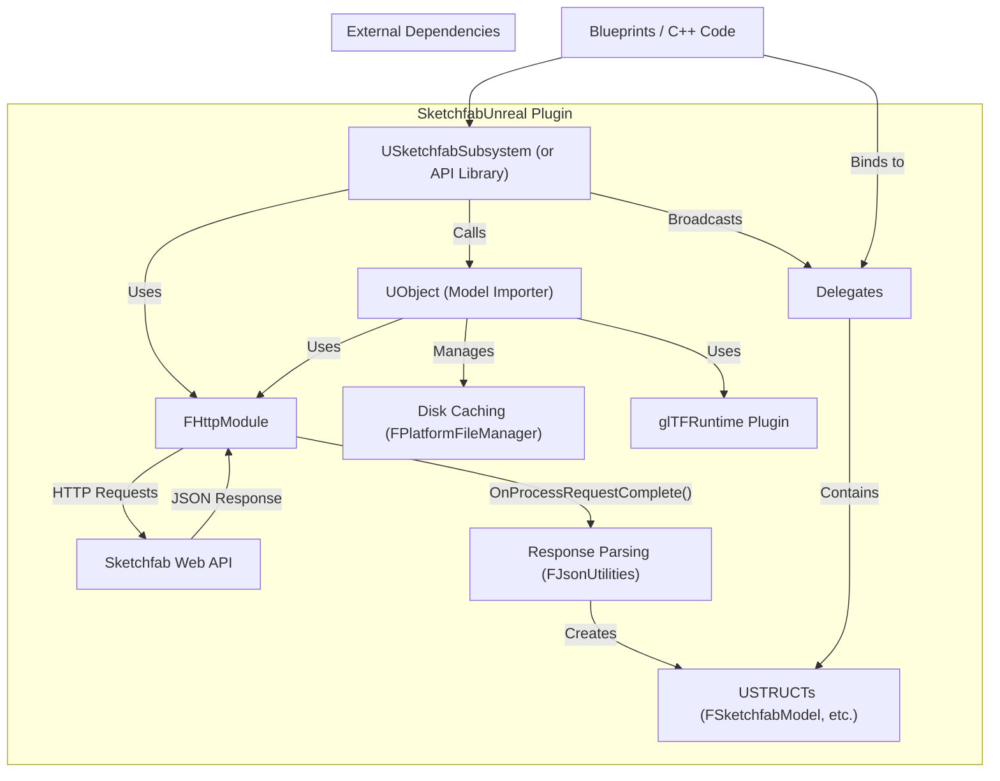
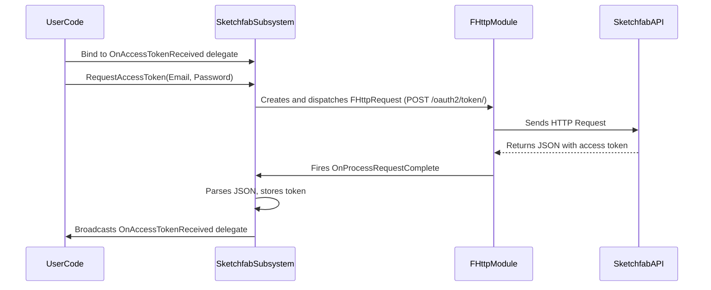
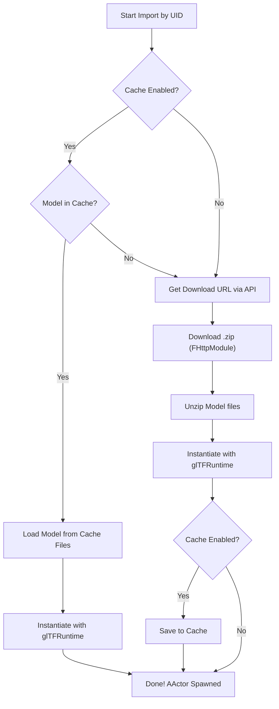

# Sketchfab for Unreal Engine Plugin Documentation

(wip: authentication doesn't work)

This document provides a comprehensive overview of the `SketchfabUnreal` plugin, its architecture, features, and how to use it in your Unreal Engine projects.

## 1. Introduction

`SketchfabUnreal` is a C++ plugin that integrates the Sketchfab API v3 into Unreal Engine. It enables developers to authenticate, search, and import 3D models from Sketchfab directly into their levels at runtime. The plugin is designed with a C++ and Blueprint-friendly API, handling HTTP requests, model downloading, and caching to provide a seamless experience.

## 2. Features

*   **Authentication**: Supports OAuth2 password-based authentication to obtain and manage access tokens.
*   **Model Search**: Perform powerful searches on Sketchfab's model library using keywords and a wide range of filters (tags, poly count, license, etc.).
*   **Model & User Information**: Fetch detailed metadata for any model or user.
*   **Category Listing**: Retrieve the list of all official Sketchfab categories.
*   **Runtime Model Import**: Download and instantiate `glTF` models directly into the scene as `AActors`.
*   **Asynchronous by Design**: All operations are non-blocking, using delegates (callbacks) to handle responses and keep the game thread free.
*   **Disk Caching**: Includes an automatic disk caching system to store downloaded models, reducing API usage and load times. The cache size and eviction policy are configurable.
*   **Blueprint Support**: Core functionalities are exposed to Blueprints via `BlueprintCallable` UFunctions for easy use by artists and designers.

## 3. Dependencies

This plugin requires the following built-in or third-party modules:

*   **`HTTP`**: For making API requests to Sketchfab.
*   **`Json` & `JsonUtilities`**: For parsing JSON data from the API.
*   **`glTFRuntime` (or similar)**: A third-party plugin is required for loading and instantiating `glTF` models at runtime. The examples assume a plugin like `glTFRuntime` is present.
    *   [glTFRuntime on Unreal Marketplace](https://www.unrealengine.com/marketplace/en-US/product/gltfruntime)

## 4. Setup and Configuration

1.  **Install the Plugin**: Place the `SketchfabUnreal` folder into your project's `Plugins` directory.
2.  **Install Dependencies**: Ensure the `glTFRuntime` plugin (or your chosen alternative) is also installed in your project's `Plugins` directory.
3.  **Enable Plugins**: Open your project in Unreal Engine, go to `Edit > Plugins`, find "SketchfabUnreal" and "glTFRuntime", and ensure they are enabled. Restart the editor if prompted.
4.  **Configure Credentials**:
    *   Go to `Edit > Project Settings`.
    *   Navigate to the `Plugins` section and find `Sketchfab`.
    *   Enter your Sketchfab **Client ID** and **Client Secret**. These settings are stored in your project's `.ini` files.

## 5. Architecture Overview

The plugin's architecture is centered around a Subsystem that manages API calls and asset handling.


*   **`USketchfabSubsystem`**: A Game Instance Subsystem that provides a global, easy-to-access entry point for all plugin functionality. It's automatically created and managed by the engine.
*   **`SketchfabModelImporter`**: A helper class responsible for the logic of downloading, caching, and spawning models.
*   **`FHttpModule`**: Unreal's built-in module for handling all HTTP communication.
*   **Delegates**: Standard Unreal delegates (e.g., `DECLARE_DYNAMIC_MULTICAST_DELEGATE_OneParam`) are used for asynchronous callbacks.
*   **`USTRUCTS`**: API data (like model info) is stored in C++ `USTRUCT`s marked with `BlueprintType` to be accessible from both C++ and Blueprints.

## 6. C++ Usage and Examples

### 6.1. Authentication

Authentication is the first step. Once successful, the access token is cached in the Subsystem for subsequent requests.



**C++ Example:**

```cpp
// In your calling class (e.g., an Actor or Component)
#include "SketchfabSubsystem.h"

void AMyActor::BeginPlay()
{
    Super::BeginPlay();

    USketchfabSubsystem* Sketchfab = GetGameInstance()->GetSubsystem<USketchfabSubsystem>();
    if (Sketchfab)
    {
        // Bind a function to the delegate
        Sketchfab->OnAccessTokenReceived.AddDynamic(this, &AMyActor::HandleAccessTokenResponse);
        
        // Make the request
        Sketchfab->RequestAccessToken("your-email@example.com", "your-password");
    }
}

UFUNCTION()
void AMyActor::HandleAccessTokenResponse(const FSketchfabAccessTokenResponse& Response)
{
    if (Response.bSuccess)
    {
        UE_LOG(LogTemp, Log, TEXT("Sketchfab Authentication Successful!"));
        // The subsystem now automatically uses the token.
    }
    else
    {
        UE_LOG(LogTemp, Error, TEXT("Sketchfab Auth Failed: %s"), *Response.Error);
    }
}
```

### 6.2. Importing a Model

The import process is fully asynchronous. You request a model by its UID, and the plugin handles fetching metadata, downloading, and spawning it.



**C++ Example:**

```cpp
#include "SketchfabSubsystem.h"
#include "glTFRuntimeAsset.h" // From glTFRuntime plugin

void AMyActor::RequestModel()
{
    USketchfabSubsystem* Sketchfab = GetGameInstance()->GetSubsystem<USketchfabSubsystem>();
    if (Sketchfab)
    {
        Sketchfab->OnModelImported.AddDynamic(this, &AMyActor::HandleModelImported);
        
        // Request a model by its UID, enabling the cache
        FSketchfabImportOptions Options;
        Options.bUseCache = true;
        Sketchfab->ImportModel("YOUR_MODEL_UID_HERE", Options);
    }
}

UFUNCTION()
void AMyActor::HandleModelImported(const FSketchfabModelImportResponse& Response)
{
    if (Response.bSuccess && Response.SpawnedActor)
    {
        UE_LOG(LogTemp, Log, TEXT("Model '%s' imported successfully!"), *Response.ModelInfo.Name);
        Response.SpawnedActor->SetActorLocation(FVector(0, 0, 100));
    }
    else
    {
        UE_LOG(LogTemp, Error, TEXT("Failed to import model."));
    }
}
```

### 6.3. Searching for Models

The search function allows you to get a list of models based on keywords and filters.

**C++ Example:**

```cpp
#include "SketchfabSubsystem.h"

void AMyActor::SearchForModels()
{
    USketchfabSubsystem* Sketchfab = GetGameInstance()->GetSubsystem<USketchfabSubsystem>();
    if (Sketchfab)
    {
        Sketchfab->OnModelSearchCompleted.AddDynamic(this, &AMyActor::HandleSearchResults);

        FSketchfabSearchRequest Request;
        Request.Keywords = "robot car";
        Request.bDownloadable = true;
        Request.MaxFaceCount = 50000;
        Request.Tags.Add("sci-fi");

        Sketchfab->SearchForModels(Request);
    }
}

UFUNCTION()
void AMyActor::HandleSearchResults(const FSketchfabSearchResponse& Response)
{
    if (Response.bSuccess)
    {
        UE_LOG(LogTemp, Log, TEXT("Found %d models."), Response.Results.Num());
        for (const FSketchfabModel& Model : Response.Results)
        {
            UE_LOG(LogTemp, Log, TEXT("- %s (UID: %s)"), *Model.Name, *Model.Uid);
        }
    }
}
``` 
